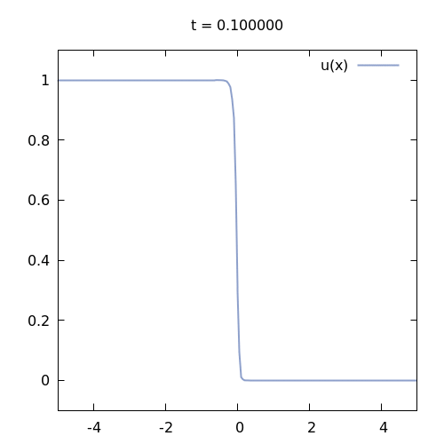

1D Nodal Discontinuous Galerkin Project
=======================================

## Introduction

This code provides a nodal discontinuous Galerkin (DG) diszretization for one-dimensional reaction–diffusion PDEs of the (loosely formulated!) form
$$
\begin{align*}
\partial_t u - \nabla \cdot (\kappa \, \nabla u) + \mu u &= f,  && \text{ in } \Omega, \\
u &= g, && \text{ on } \partial\Omega,
\end{align*}
$$
with the weak form
$$
u^{n+1} - u^{n} + \Delta t \, a(u^{n+1}, v) = \Delta t \, \int_{\Omega} f v.
$$
The discretization is inspired by [1] (Section 4.6.2), which corresponds roughly to
$$
\begin{align*}
a(u, v_h) =& \int_{\Omega} \kappa \, \nabla_{h} u \cdot \nabla_{h} v_h
          + \sum_{F \in \mathcal{F}_h} \eta \, \gamma_{\kappa,F, h_{F}} \int_{F} [\![u]\!] \, [\![v_h]\!]  \\
          &- \sum_{F \in \mathcal{F}_h} \int_{F} \bigl(  \{\!\{  \kappa \, \nabla_{h} u \}\!\} \cdot \mathbf{n}_{F} \, [\![v_h]\!]   +   [\![u]\!] \, \{\!\{  \kappa \, \nabla_{h} v_h \}\!\} \cdot \mathbf{n}_{F}   \bigr).
\end{align*}
$$

## Installation

You need to have cmake and a C++-compiler (gcc/clang), or you can make use of the provided devcontainer.

Then, run
~~~ bash
mkdir build  
cd build
cmake ..
make -j
~~~

The tests can be run via
~~~ bash
ctest --output-on-failure
~~~

Set up pre-commit hooks vi `pre-commit install`.

The code documentation can be build by `make doc`.

Run the simulation via `ndg.exe` in `build/bin`.
A parameter configuration can be loaded via `ndg.exe --config parameters.conf`, located in `config/`.

## References

* [1] _Mathematical Aspects of Discontinuous Galerkin Methods_ by Di Pietro, D. A. and Ern, A. (2012) [doi: 10.1007/978-3-642-22980-0](https://doi.org/10.1007/978-3-642-22980-0)
* [2] _Nodal Discontinuous Galerkin Methods_ by Hesthaven, J. S. and Warburton, T. (2008) [doi: 10.1007/978-0-387-72067-8](https://doi.org/10.1007/978-0-387-72067-8)
